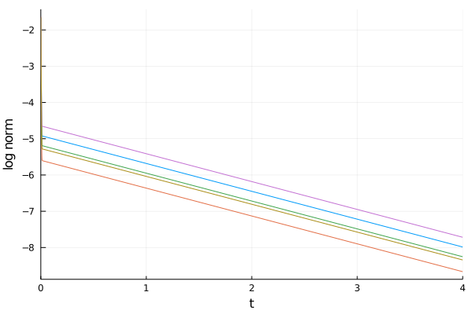

## Requirements
- [JuMP](https://github.com/jump-dev/JuMP.jl)
- [Cbc](https://github.com/jump-dev/Cbc.jl)
- [FFTW](https://github.com/JuliaMath/FFTW.jl)
- [Plots](https://github.com/JuliaPlots/Plots.jl)

## Examples
- [`solve.jl`](solve.jl)

    For a given number of oscillators `N` and `p`-twisted state,
    the maiximum connectivity that allows `p`-twisted state to be stable
    is obtained by solving a integer programming problem (Problem 1 in the paper).
    There are two ways to solve the problem:

    - First, you can directly solve the problem using mathematical optimization package [JuMP](https://github.com/jump-dev/JuMP.jl).
    Function `max_connectivity(N,p)` give you the numerical solution of the problem.
    Inside the function, we use [Cbc](https://github.com/jump-dev/Cbc.jl) for the optimizer.
    For example, `max_connectivity(1900, 100)` will return a `DenseSync` struct.
    ```
    DenseSync{
     system size: 1900, p-twisted state: 100, 
     μ = 1297//1899 ≃ 0.6829910479199579
     x = [1, 1, 1, 1, 1, 1, 0, 0, 0, 0  …  0, 0, 0, 0, 1, 1, 1, 1, 1, 1]
    }
    ```

    - As stated in Theorem 1, the integer programming problem we formulated
    has an exact solution.
    Function `exact_sol(N,p)` will give you the exact solution.
    The return value is a `DenseSync` struct.

- [`ode.jl`](ode.jl)

    It is important to check if the optimized network actually has an equilibrium point other than the in-phase solution.
    Function `DenseSyncODE(ds::DenseSync, δt, tmax)` run the ODE
    with the initial value randomly perturbed from `p`-twisted state
    and track the distance.
    Inside the function, Runge-Kutta method is used for solving the ODE,
    and `δt` is the time-step and `tmax` is the maximum time.
    For example, we run `DenseSyncODE(max_connectivity(1900, 100), 10^(-3), 4)`
    for five times.
    The time-dependence of the norm is plotted as follows.
    It is well converged to `p`-twisted state, which implies that
    the optimized network actually makes the `p`-twisted state stable!!

    
