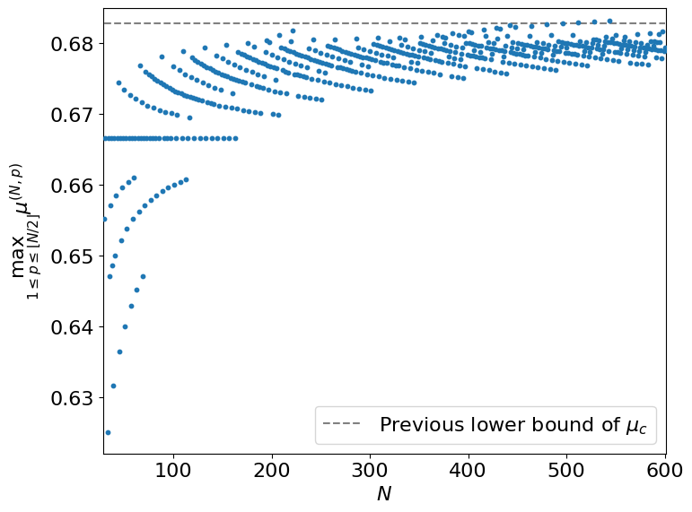
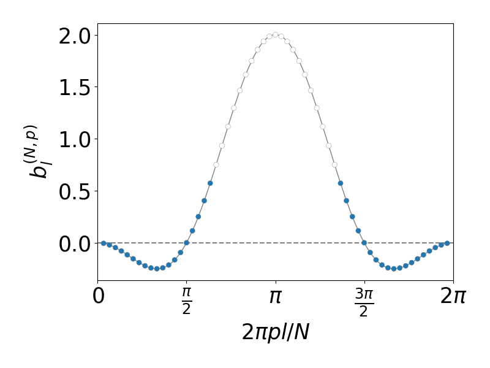
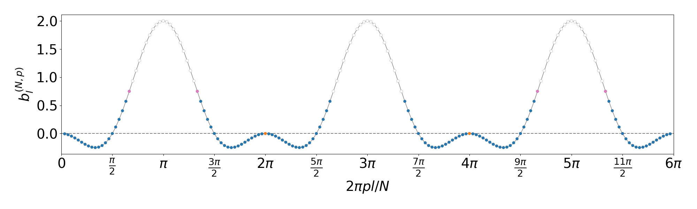
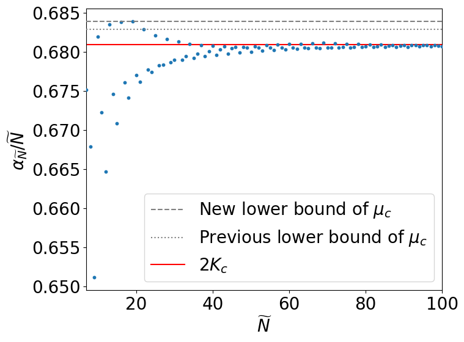
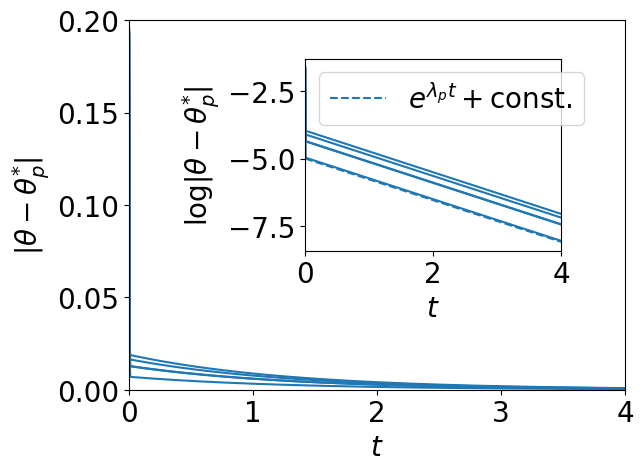
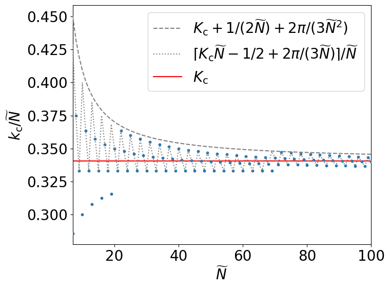

## Experiments

### Figure 1

[`solve_ip.py`](solve_ip.py) and [`solve_ip_multi.py`](solve_ip_multi.py) are solving an integer programming problem (Problem 1 in the paper).

You need to execute either one.

+ single processing ver.

    ```
    python solve_ip.py -m hp.max_N=600
    ```

+ multi processing ver.

    This program is faster than single processing ver.

    ```
    python solve_ip_multi.py -m hp.max_N=600
    ```


After the execution, the maximum connectivity for each N and p is saved as `./results/results.csv`.
The graph of the maximum connectivity and the number of oscillators is plotted by the below command.

```
python max_connectivity.py
```



### Figure 2

```
python n60p1.py
```



### Figure 3

```
python n180p3.py
```



### Figure 4

```
python sup_m.py
```



### Figure 5

```
python odeplot.py -m ode_plot.N=1900 ode_plot.p=100
```



### Figure 6

```
python kc.py
```




## For developer

After you have finished editing the python files, please execute the following command.

```
pysen run lint
pysen run format
```

## Tests

```
python -m unittest discover tests
```